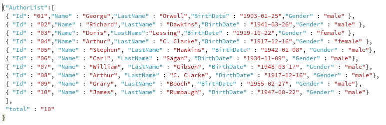
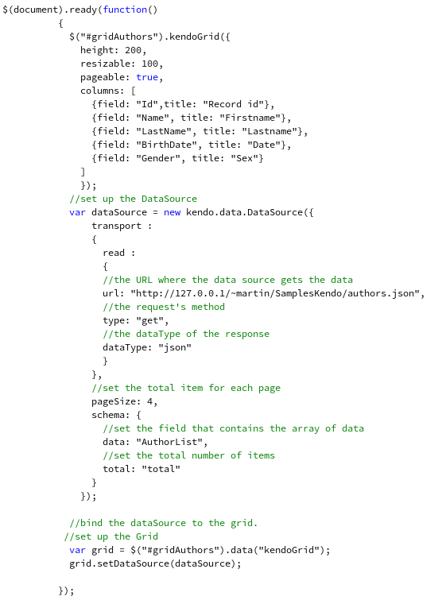
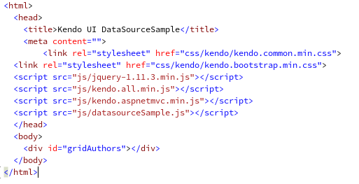
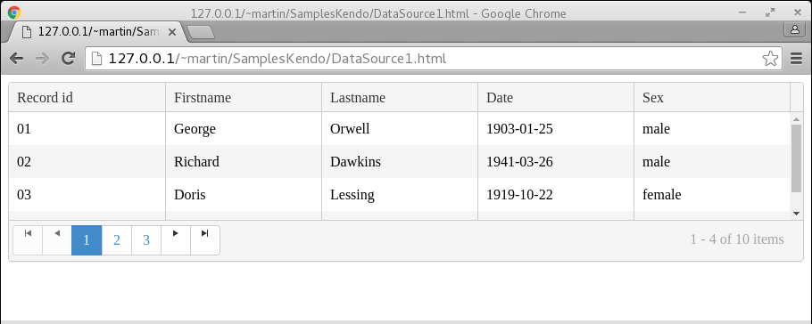
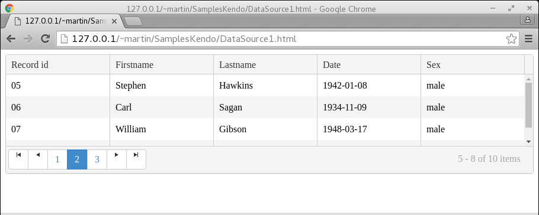
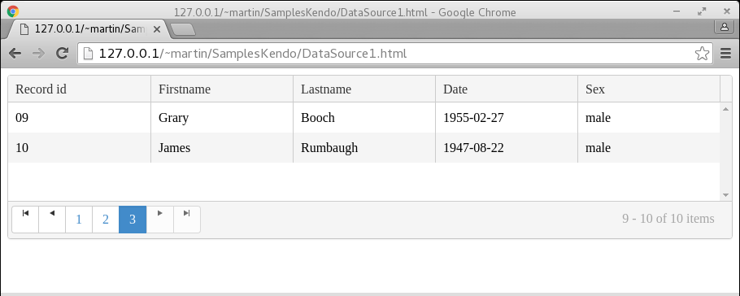

# Entendiendo kendo UI DataSource de Telerik con JavaScript
		

El control <b>DataSource</b> es uno de los componentes centrales en la suite de controles <a href="http://www.telerik.com/kendo-ui">Kendo UI</a> de <a href="http://www.telerik.com/">Telerik</a>
ya que es el componente que proporciona el acceso a fuentes de datos para el resto de los controles de la suite, entre las fuentes de
datos que soporta el control se encuentran los formatos JSON, XML y Odata, estas fuentes de datos pueden estar de forma local o remota
respectivamente.

Uno de los controles que más se complementa de la funcionalidad del <b>DataSource</b> es sin duda el control <b>Grid</b>, ya que no solo obtiene los datos del <b>DataSource</b>, sino que además el comportamiento del <b>Grid</b> se ve influido por la configuración que el <b>DataSource</b> le proporcione.

A continuación enumeraré las opciones para la configuración del <b>DataSource</b> que utilicé en este ejemplo:

<table>
  <tr>
<td><b>Transport</b></td>
<td>Esta opción describe la configuración del endpoint en donde se encuentran los datos se configuran opciones como: URL, HTTP Verb, Data Type, etc.</td>
</tr>
<tr>
<td><b>Transport.Read</b></td>
<td>Se utiliza cuando se van a solicitar los datos desde una ubicación remota como un web service o server.</td>
 </tr>
  <tr>
<td><b>PageSize</b></td>
<td>El número de registros por página.</td>
</tr>
 <tr>
<td><b>Schema</b></td>
<td>El diseño lógico de los datos.</td>
 </tr>
  <tr>
<td><b>Schema. Data</b></td>
<td>Se establece la estructura  que contiene los datos recibida como respuesta desde un servidor remoto.</td>
 </tr>
 <tr>
<td><b>Schema.Total</b></td>
<td>El número total de registros que contiene la estructura de datos recibida como respuesta desde un servidor remoto.</td>
 </tr>
</table>

En el siguiente programa de ejemplo, utilizo la propiedad transport del <b>DataSource</b> para obtener el  archivo <i>authors.txt</i> que se encuentra en el URL: “http://127.0.0.1/~martin/SamplesKendo/authors.txt” (este archivo se encuentra en un Apache Web Server), y los datos contenidos están en formato <b>JSON</b> como se muestra a continuación: 

<b>Fig 1</b> El archivo authors.json.
 
<!--Code authors.json-->

 
<!--Code-->

Una vez teniendo el archivo de datos, la configuración del <b>DataSource</b> queda como en el siguiente código JavaScript

<!--Code JS-->

 
<!--Code JS-->

Esa es la parte JavaScript que tiene la funcionalidad, a continuación el código de la página HTML completa.

<!--Code HTML-->

 
<!--Code HTML-->

Al ejecutar el código se produce el siguiente resultado:

<b>Fig 2 Databinding con el control DataSource.</b>
 

 

<b>Fig 3 Paging con DataSource y Grid.</b>
 

 

<b>Fig 4 Last record con DataSource y Grid. </b>
 

